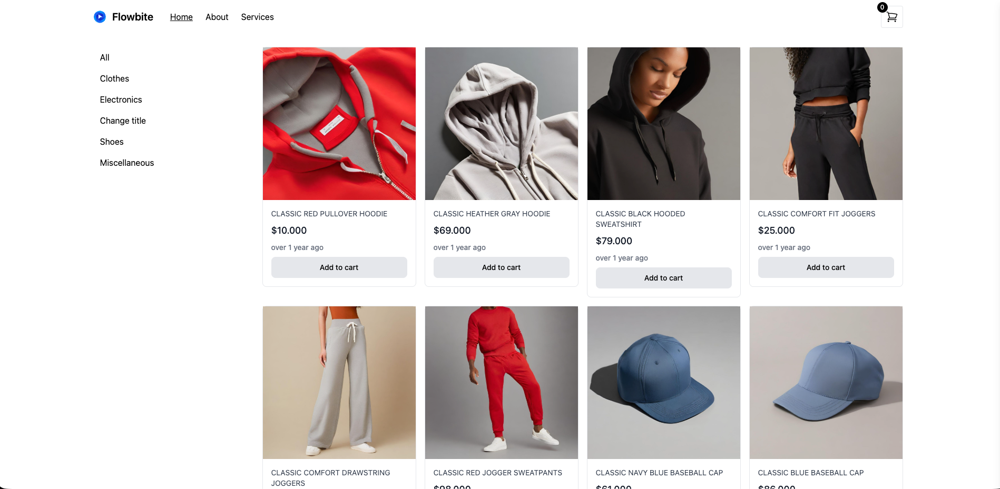
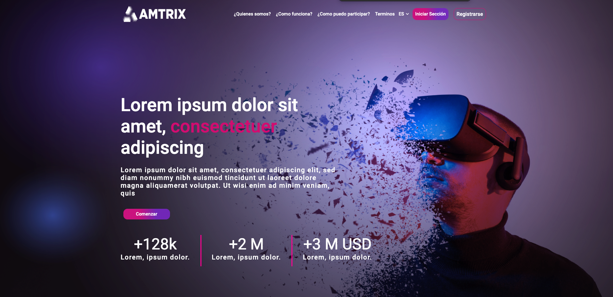
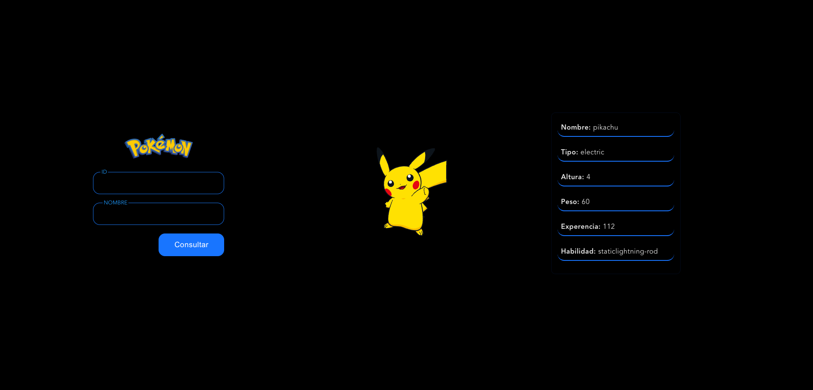

# 👋 Hola, soy Luis Fernando Rengifo Ruiz

### Frontend Developer | Angular · React · Vue

---

## 🚀 Sobre mí

Soy Frontend Developer con más de 3 años de experiencia construyendo aplicaciones web en sectores de **seguridad**, **fintech** y **blockchain**. Me especializo en crear interfaces escalables y experiencias de usuario sólidas. Con conocimientos en backend con .NET y Node.js que me permiten trabajar en arquitecturas full stack.

📍 Medellín, Colombia — Disponible para trabajo remoto

---

## 🛠️ Tech Stack

**Frontend**

**Backend**

**Bases de datos**

**Herramientas**

---

## 💼 Experiencia destacada

| Empresa                | Rol                  | Período             |
| ---------------------- | -------------------- | ------------------- |
| PersonalSoft           | Software Developer   | Jul 2025 – Ene 2026 |
| 7Way Security          | Frontend Developer   | Nov 2024 – May 2025 |
| Freelance              | Full Stack Developer | Sep 2023 – Oct 2024 |
| Santos Blockchain Labs | Full Stack Developer | Ene 2022 – Jul 2023 |

---

## 🌟 Proyectos destacados

  
  
  
  

### [🔗 Portafolio Personal](https://luisruiz2000.github.io/Portafoliov1/)

Mi portafolio web construido con React + Vite, donde puedes ver mis proyectos y experiencia.

---

---

<!-- ## 📊 GitHub Stats

 -->

---

## 📫 Contacto

